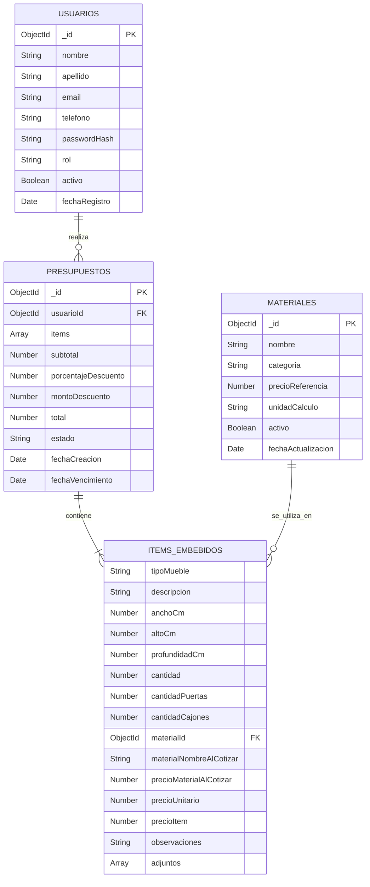

# TP Intermedio Backend
## Isasi Muebles
### Diseño de base de datos MongoDB

**Curso:** Backend Developer  
Allumna Cassia Regina Dias
**Proyecto:** Sistema de presupuestos estimativos para Isasi Muebles  
**Fecha:** 24/09/2026

---

# 1. Elección del dominio

Sistema de gestión y cotización de muebles a medida para Isasi Muebles, utilizado por clientes registrados y administradores.

## Descripción del proyecto

El sistema permitirá a los clientes registrados solicitar presupuestos estimativos de muebles a medida. En cada solicitud deberán especificar el tipo de mueble, sus medidas, el material y las características necesarias para cotizarlo. También podrán adjuntar fotografías o croquis como información complementaria.

El objetivo es organizar las solicitudes y los precios de los materiales en una base de datos que permita, en una etapa posterior, automatizar el cálculo de presupuestos y reducir el tiempo de cotización.

El sistema contemplará dos roles:

- **Cliente:** podrá registrarse, completar y enviar solicitudes con las medidas, los materiales y las características de cada mueble, adjuntar documentación y consultar el estado y el historial de sus solicitudes.
- **Administrador:** podrá mantener el catálogo de materiales y precios, revisar las solicitudes, completar las cotizaciones y actualizar su estado.

La cotización online estará destinada a muebles con medidas, materiales y características definidos. Si faltan datos o el proyecto requiere desarrollar una propuesta de diseño, la consulta se atenderá de manera personalizada.

En esta primera etapa académica se desarrollará exclusivamente el diseño de la base de datos. La automatización de los cálculos se implementará posteriormente.

---

# 2. Diagrama del modelo

## 2.1. Colecciones principales

El sistema estará compuesto inicialmente por tres colecciones de MongoDB.

### Usuarios

Almacena los datos de las personas registradas y sus respectivos roles.

| Campo | Tipo MongoDB | Descripción |
|---|---|---|
| _id | ObjectId | Identificador único |
| nombre | String | Nombre del usuario |
| apellido | String | Apellido |
| email | String | Correo electrónico |
| telefono | String | Teléfono de contacto |
| passwordHash | String | Contraseña protegida |
| rol | String | cliente o admin |
| activo | Boolean | Estado de la cuenta |
| fechaRegistro | Date | Fecha de registro |

El correo electrónico será único para cada usuario.

Las contraseñas no se almacenarán como texto plano, sino mediante un hash seguro.

### Materiales

Almacena el catálogo de materiales y los precios de referencia administrados por Isasi.

| Campo | Tipo MongoDB | Descripción |
|---|---|---|
| _id | ObjectId | Identificador único |
| nombre | String | Nombre del material |
| categoria | String | Melamina, laqueado o madera |
| precioReferencia | Number | Precio registrado |
| unidadCalculo | String | Unidad utilizada para cotizar |
| activo | Boolean | Disponibilidad |
| fechaActualizacion | Date | Última actualización del precio |

Los precios se expresarán en pesos argentinos.

Los valores de esta colección podrán actualizarse sin modificar los presupuestos emitidos anteriormente.

### Presupuestos

Es la entidad principal de la aplicación.

Contiene las solicitudes realizadas por los clientes, los muebles incluidos y los resultados de la cotización.

| Campo | Tipo MongoDB | Descripción |
|---|---|---|
| _id | ObjectId | Identificador único |
| usuarioId | ObjectId | Referencia al cliente |
| items | Array | Muebles incluidos |
| subtotal | Number | Suma de los ítems |
| porcentajeDescuento | Number | Descuento aplicado |
| montoDescuento | Number | Importe descontado |
| total | Number | Importe final |
| estado | String | Estado del presupuesto |
| fechaCreacion | Date | Fecha de creación de la solicitud |
| fechaVencimiento | Date | Vencimiento del presupuesto emitido, cuando corresponda |

Los estados previstos son: solicitado, en_revision, cotizado, aceptado, rechazado y vencido. Los importes se completarán al preparar la cotización; una solicitud recién enviada puede no tener precios todavía.

La validez se establecerá cuando se emita el presupuesto y se determinará mediante la fecha de vencimiento.

## 2.2. Estructura de los ítems

Cada presupuesto podrá incluir uno o varios muebles definidos.

Los ítems se almacenarán como objetos embebidos dentro del presupuesto.

| Campo | Tipo MongoDB | Descripción |
|---|---|---|
| tipoMueble | String | Tipo de mueble solicitado |
| descripcion | String | Características del mueble |
| anchoCm | Number | Ancho en centímetros |
| altoCm | Number | Alto en centímetros |
| profundidadCm | Number | Profundidad |
| cantidad | Number | Unidades solicitadas |
| cantidadPuertas | Number | Número de puertas |
| cantidadCajones | Number | Número de cajones |
| materialId | ObjectId | Referencia a materiales |
| materialNombreAlCotizar | String | Nombre del material utilizado |
| precioMaterialAlCotizar | Number | Precio de referencia al cotizar |
| precioUnitario | Number | Precio de una unidad |
| precioItem | Number | Importe total del ítem |
| observaciones | String | Información adicional |
| adjuntos | Array | Rutas o URL de fotografías y croquis opcionales |

El precio del material y su nombre se conservarán dentro del ítem como registro de los valores utilizados al emitir el presupuesto.

## 2.3. Diagrama de relaciones



**Aclaración:** ITEMS_EMBEBIDOS no constituye una cuarta colección. Representa los objetos almacenados en el array `items` de cada presupuesto.

## 2.4. Cardinalidad

**Usuarios y presupuestos: 1:N**

Un usuario puede realizar múltiples presupuestos. Cada presupuesto pertenece a un único usuario.

**Presupuestos e ítems: 1:N**

Un presupuesto contiene uno o varios ítems. Cada ítem pertenece exclusivamente al presupuesto en el que está embebido.

**Materiales e ítems: 1:N**

Un material puede utilizarse en múltiples ítems de diferentes presupuestos. Cada ítem referencia un material mediante `materialId`.

La relación entre Presupuestos y Materiales se establece a través del campo `items.materialId`, que almacena un ObjectId de la colección Materiales.

---

# 3. Justificación de embeber vs. referenciar

## 3.1. Referencia a materiales

La colección Materiales se mantiene independiente y se relaciona con los ítems de Presupuestos mediante ObjectId.

Esta decisión responde a tres motivos:

**Reutilización:** un mismo material puede utilizarse en numerosos presupuestos y en diferentes tipos de muebles.

**Actualización independiente:** Isasi podrá actualizar los precios y la disponibilidad sin modificar cada presupuesto que utilice ese material.

**Evitar duplicación:** las características y los valores vigentes de cada material se administran en una única colección.

Cada ítem guarda `materialId` para consultar el material correspondiente.

Adicionalmente, se conserva una copia del nombre y del precio de referencia utilizado al cotizar. Esto permite mantener el registro económico original aunque posteriormente cambien los precios del catálogo.

## 3.2. Referencia a usuarios

Cada presupuesto almacena el ObjectId del usuario que lo solicitó mediante el campo `usuarioId`.

De esta manera, un mismo cliente puede realizar múltiples solicitudes sin duplicar todos sus datos personales en cada documento.

La referencia también permite consultar su historial.

## 3.3. Ítems embebidos

Los muebles solicitados se almacenarán dentro del presupuesto mediante un array de objetos embebidos.

Esta decisión se justifica porque:

- Cada ítem pertenece a un presupuesto específico.
- Los ítems se consultan habitualmente junto con su presupuesto.
- Las características, cantidades y precios corresponden a esa cotización particular.
- No necesitan actualizarse de forma independiente para otros presupuestos.

Por ejemplo, las medidas y los precios de un bajo mesada solicitado por un cliente no tienen por qué coincidir con los de otro cliente.

La aplicación podrá establecer límites razonables para la cantidad de ítems de cada solicitud.

El resultado es un modelo con tres colecciones principales, referencias entre documentos y objetos embebidos donde corresponde.

---

# 4. Índices propuestos

Los siguientes índices permitirán mejorar las consultas frecuentes de la aplicación.

## 4.1. Índice único para el correo electrónico

**Colección:** usuarios  
**Campo:** email  
**Tipo:** único

```js
db.usuarios.createIndex(
  { email: 1 },
  { unique: true }
)
```

Impide registrar dos cuentas con el mismo correo electrónico.

La aplicación normalizará previamente el email para evitar duplicaciones por diferencias entre mayúsculas y minúsculas.

## 4.2. Índice para el historial del cliente

**Colección:** presupuestos  
**Campos:** usuarioId y fechaCreacion

```js
db.presupuestos.createIndex(
  { usuarioId: 1, fechaCreacion: -1 }
)
```

Permite obtener eficientemente los presupuestos de un cliente y ordenarlos desde el más reciente.

## 4.3. Índice para consultas por material

**Colección:** presupuestos  
**Campo:** items.materialId

```js
db.presupuestos.createIndex(
  { "items.materialId": 1 }
)
```

Permite localizar presupuestos que contienen un material específico.

MongoDB crea un índice multiclave cuando el campo indexado pertenece a un array.

## 4.4. Índice para la gestión administrativa

**Colección:** presupuestos  
**Campos:** estado y fechaCreacion

```js
db.presupuestos.createIndex(
  { estado: 1, fechaCreacion: -1 }
)
```

Facilita que el administrador consulte las solicitudes pendientes, cotizadas o aceptadas, ordenándolas por fecha.

---

# 5. Documentos JSON de ejemplo

Se presentan tres documentos por cada colección, con datos ficticios y referencias coherentes entre sí.

Se utiliza el formato Extended JSON de MongoDB para representar ObjectId y Date.

Los precios son exclusivamente ilustrativos y no representan los valores comerciales reales de Isasi Muebles.

## 5.1. Colección usuarios

```json
[
  {
    "_id": { "$oid": "650000000000000000000001" },
    "nombre": "Laura",
    "apellido": "Gómez",
    "email": "laura@example.com",
    "telefono": "1100000001",
    "passwordHash": "HASH_FICTICIO_1",
    "rol": "cliente",
    "activo": true,
    "fechaRegistro": {
      "$date": "2026-09-01T12:00:00.000Z"
    }
  },
  {
    "_id": { "$oid": "650000000000000000000002" },
    "nombre": "Martín",
    "apellido": "Fernandez",
    "email": "martin@example.com",
    "telefono": "1100000002",
    "passwordHash": "HASH_FICTICIO_2",
    "rol": "cliente",
    "activo": true,
    "fechaRegistro": {
      "$date": "2026-09-05T12:00:00.000Z"
    }
  },
  {
    "_id": { "$oid": "650000000000000000000003" },
    "nombre": "Administrador",
    "apellido": "Isasi",
    "email": "admin@example.com",
    "telefono": "1100000003",
    "passwordHash": "HASH_FICTICIO_3",
    "rol": "admin",
    "activo": true,
    "fechaRegistro": {
      "$date": "2026-09-01T12:00:00.000Z"
    }
  }
]
```

Los hashes son marcadores ficticios utilizados únicamente para documentar el esquema. En la implementación se generarán hashes de contraseñas reales mediante una herramienta de seguridad apropiada.

## 5.2. Colección materiales

```json
[
  {
    "_id": { "$oid": "660000000000000000000001" },
    "nombre": "Melamina blanca",
    "categoria": "melamina",
    "precioReferencia": 42000,
    "unidadCalculo": "m2",
    "activo": true,
    "fechaActualizacion": {
      "$date": "2026-09-20T12:00:00.000Z"
    }
  },
  {
    "_id": { "$oid": "660000000000000000000002" },
    "nombre": "Laqueado blanco mate",
    "categoria": "laqueado",
    "precioReferencia": 89000,
    "unidadCalculo": "m2",
    "activo": true,
    "fechaActualizacion": {
      "$date": "2026-09-20T12:00:00.000Z"
    }
  },
  {
    "_id": { "$oid": "660000000000000000000003" },
    "nombre": "Madera de paraíso",
    "categoria": "madera",
    "precioReferencia": 125000,
    "unidadCalculo": "m2",
    "activo": true,
    "fechaActualizacion": {
      "$date": "2026-09-20T12:00:00.000Z"
    }
  }
]
```

Los tres materiales pertenecen al catálogo de ejemplo y pueden ser utilizados por diferentes presupuestos.

La unidad de cálculo real de cada producto se definirá al construir el catálogo definitivo.

## 5.3. Colección presupuestos

### Presupuesto 1: bajo mesada

El cliente solicita un bajo mesada de melamina blanca, con cinco cajones y dos puertas.

```json
{
  "_id": { "$oid": "670000000000000000000001" },
  "usuarioId": {
    "$oid": "650000000000000000000001"
  },
  "items": [
    {
      "tipoMueble": "Bajo mesada",
      "descripcion": "Bajo mesada con cinco cajones y dos puertas",
      "anchoCm": 180,
      "altoCm": 85,
      "profundidadCm": 60,
      "cantidad": 1,
      "cantidadPuertas": 2,
      "cantidadCajones": 5,
      "materialId": {
        "$oid": "660000000000000000000001"
      },
      "materialNombreAlCotizar": "Melamina blanca",
      "precioMaterialAlCotizar": 42000,
      "precioUnitario": 650000,
      "precioItem": 650000,
      "observaciones": "Herrajes estándar",
      "adjuntos": []
    }
  ],
  "subtotal": 650000,
  "porcentajeDescuento": 0,
  "montoDescuento": 0,
  "total": 650000,
  "estado": "cotizado",
  "fechaCreacion": {
    "$date": "2026-09-24T13:00:00.000Z"
  },
  "fechaVencimiento": {
    "$date": "2026-10-01T13:00:00.000Z"
  }
}
```

### Presupuesto 2: amoblamiento de cocina

El cliente solicita dos módulos con terminaciones diferentes.

Se aplica un descuento general del 5 % sobre el conjunto.

```json
{
  "_id": { "$oid": "670000000000000000000002" },
  "usuarioId": {
    "$oid": "650000000000000000000002"
  },
  "items": [
    {
      "tipoMueble": "Bajo mesada",
      "descripcion": "Bajo mesada con puertas y cajones",
      "anchoCm": 240,
      "altoCm": 85,
      "profundidadCm": 60,
      "cantidad": 1,
      "cantidadPuertas": 4,
      "cantidadCajones": 3,
      "materialId": {
        "$oid": "660000000000000000000001"
      },
      "materialNombreAlCotizar": "Melamina blanca",
      "precioMaterialAlCotizar": 42000,
      "precioUnitario": 850000,
      "precioItem": 850000,
      "observaciones": "Instalación a evaluar",
      "adjuntos": ["/ejemplos/croquis-cocina.pdf"]
    },
    {
      "tipoMueble": "Alacena",
      "descripcion": "Alacena con cuatro puertas",
      "anchoCm": 240,
      "altoCm": 70,
      "profundidadCm": 35,
      "cantidad": 1,
      "cantidadPuertas": 4,
      "cantidadCajones": 0,
      "materialId": {
        "$oid": "660000000000000000000002"
      },
      "materialNombreAlCotizar": "Laqueado blanco mate",
      "precioMaterialAlCotizar": 89000,
      "precioUnitario": 480000,
      "precioItem": 480000,
      "observaciones": "Apertura tradicional",
      "adjuntos": []
    }
  ],
  "subtotal": 1330000,
  "porcentajeDescuento": 5,
  "montoDescuento": 66500,
  "total": 1263500,
  "estado": "cotizado",
  "fechaCreacion": {
    "$date": "2026-09-24T14:00:00.000Z"
  },
  "fechaVencimiento": {
    "$date": "2026-10-01T14:00:00.000Z"
  }
}
```

### Presupuesto 3: placard

El cliente solicita un placard a medida con terminación en madera de paraíso.

```json
{
  "_id": { "$oid": "670000000000000000000003" },
  "usuarioId": {
    "$oid": "650000000000000000000001"
  },
  "items": [
    {
      "tipoMueble": "Placard",
      "descripcion": "Placard con seis puertas y cuatro cajones",
      "anchoCm": 240,
      "altoCm": 250,
      "profundidadCm": 60,
      "cantidad": 1,
      "cantidadPuertas": 6,
      "cantidadCajones": 4,
      "materialId": {
        "$oid": "660000000000000000000003"
      },
      "materialNombreAlCotizar": "Madera de paraíso",
      "precioMaterialAlCotizar": 125000,
      "precioUnitario": 1700000,
      "precioItem": 1700000,
      "observaciones": "Distribución interior definida por el cliente",
      "adjuntos": []
    }
  ],
  "subtotal": 1700000,
  "porcentajeDescuento": 0,
  "montoDescuento": 0,
  "total": 1700000,
  "estado": "aceptado",
  "fechaCreacion": {
    "$date": "2026-09-15T13:00:00.000Z"
  },
  "fechaVencimiento": {
    "$date": "2026-10-15T13:00:00.000Z"
  }
}
```

## 5.4. Consistencia de las referencias

Los tres documentos de Presupuestos utilizan usuarios y materiales existentes en las colecciones de ejemplo.

- El presupuesto 1 pertenece a Laura y utiliza melamina blanca.
- El presupuesto 2 pertenece a Martin y utiliza melamina blanca y laqueado blanco mate.
- El presupuesto 3 pertenece a Laura y utiliza madera de paraíso.

Los identificadores ObjectId coinciden entre las colecciones.

Los importes de ejemplo incluyen conceptualmente materiales, componentes y fabricación. No se derivan exclusivamente del precio por metro cuadrado, porque las fórmulas de cálculo reales todavía deben definirse con Isasi.

---

# Conclusión

El modelo propuesto permite administrar usuarios, materiales y presupuestos mediante una estructura de tres colecciones relacionadas.

La utilización de referencias ObjectId permite reutilizar materiales, actualizar el catálogo y mantener el historial de los clientes.

Los ítems embebidos almacenan las características particulares de cada mueble, sus medidas y sus valores económicos.

Esta estructura constituye la base para desarrollar posteriormente una API con Express y Mongoose y un sistema de presupuestación automática que utilice los precios y las reglas de cálculo establecidos por Isasi Muebles.
